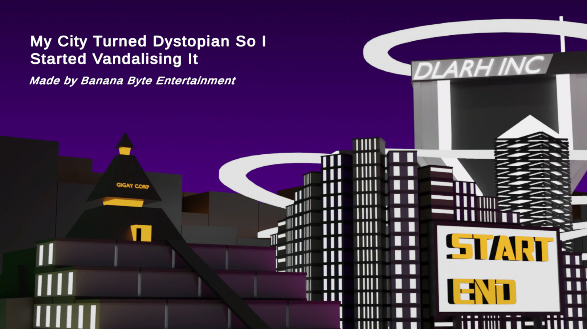
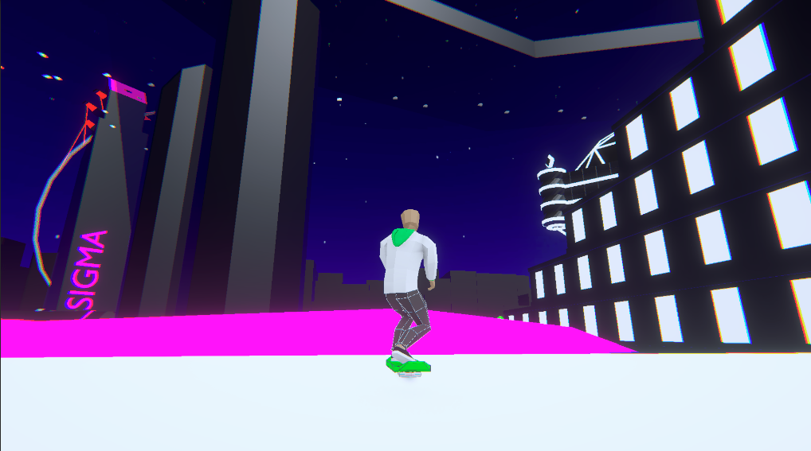
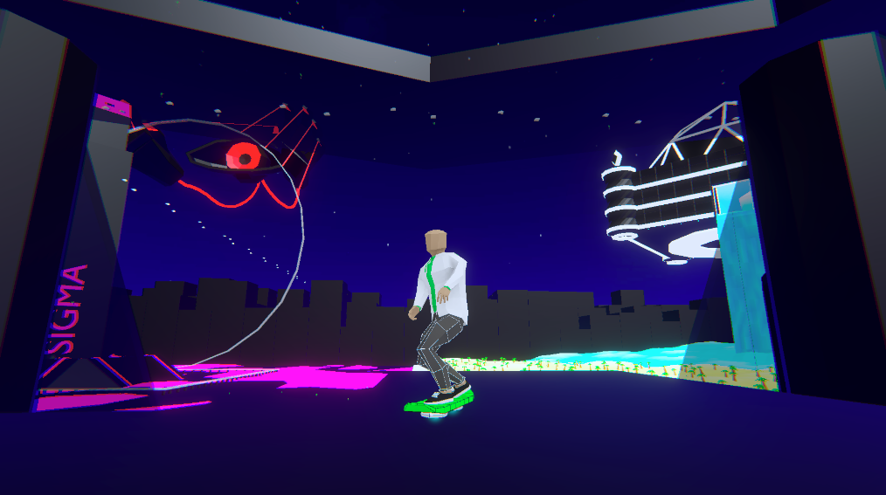

# My City Turned Dystopian So I Started Vandalising It


## About

This is the source code for *My City Turned Dystopian So I Started Vandalising It*, a game developed by *Banana Byte Entertainment*!

This game is an action-adventure hoverboard game that combines skateboarding-style gameplay with urban exploration and creative expression. You, the player, ride a hoverboard through a cyberpunk-styled dystopian city environment, performing tricks on rails and creating graffiti art on various surfaces.


## Project Structure

This is a Unity project built using C#. Key folders:

```text
Assets/
├── Scripts/         # Game logic
├── Scenes/          # Game levels and environments
├── Models/          # 3D models and assets
├── Materials/       # Visual materials and shaders
├── Animations/      # Character and object animations
├── Prefabs/         # Reusable game objects
├── UI/              # User interface elements
└── Audio/           # Music and sound effects
```

To explore or modify the game:

1. Clone this repository.
2. Open it in *Unity 6.1+*.
3. Hit Play and start skateboarding!

## Tech Stack

- Engine: Unity
- 3D Models: Blender
- Language: C#
- Platforms: Windows (32-, 64-bit), macOS (Intel, Apple Silicon), Linux (64-bit)
- Input: Keyboard and Mouse

## Team

This game was conceptualised, designed, and developed by *Banana Byte Entertainment* for a game jam. It is available to download on itch.io.

<a href="https://github.com/Banana-Byte-Entertainment/My-City-Turned-Dystopian-So-I-Started-Vandalising-It/graphs/contributors">
  
</a>

## License

This project is provided for educational and portfolio purposes. Please [contact the authors](mailto:bananabyteentertainment@gmail.com) for inquiries about reuse or distribution.

<!-- ---

*Experience the thrill of urban hoverboarding in this unique blend of extreme sports and creative expression!* -->
